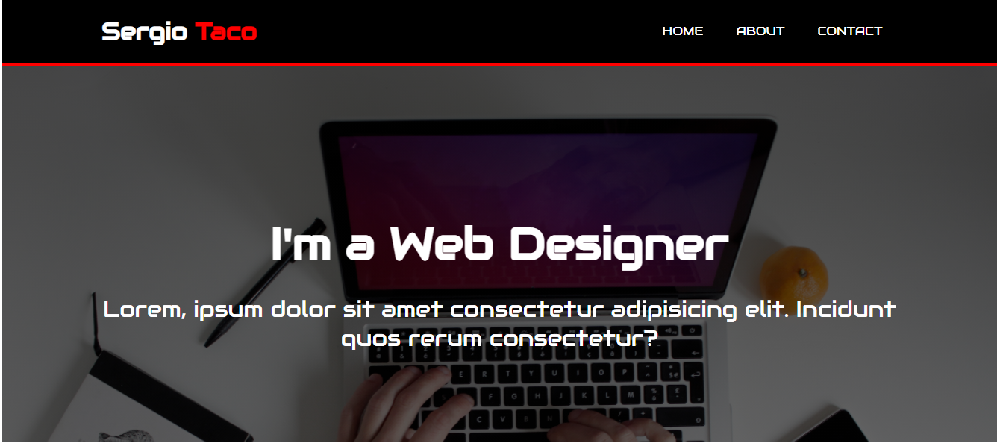

<center></center>
<br>

<center><h1> HTML & CSS Workshop</h1></center>
<p>Clarusway</p>
<br>

# Subject: HTML & CSS Workshop

## Learning Goals

- Practice using the HTML & CSS basic commands and create a portfolio page.

## Introduction

We've covered HTML Headings, Formatting Elemenets, Tables, Images, Links and CSS Basics, but now it's time to put the concepts into practice. We'll start with building a portfolio page.

## Practice Building a Portfolio Page

You might notice a few new things in this lesson that you haven't encountered
before. We'll walk you through them.

<br>
<hr>

## Problem Statement

- Write a code that creates a Portfolio Page.



- Functionally similar to this: [Portfolio Page](https://sergiotaco.github.io/html-css-workshop/)

## Additional Resourses

- Picture's link [Image One](https://github.com/clarusway/clarusway-it-fundamentals-7-20/blob/main/html-css/workshop/banner.jpg)

# Code Along

<br>
Your Portfolio Page consists of 3 different pages. First and the main page is Home Page. Second one is About Page and third one is Contact Page. You can navigate between pages.
<br> <br>
1. Your portfolio should have a home page. Home page should have a header section with an id of "header". In this header section there will be a division with an id of "container". This container will have two other divisions. First division will have an "h1" element that contains text. Second division will have a navigation bar.

```

```

<br>
2.  Home page should have a main section with an id of "main". Main section will have a division with an id of "container". This container will have an "h1" and "p" elements that contain text.

```

```

<br>
3.  Your about page should have an about section with an id of "about. About section will have an "h2" and "p" elements that contain text.

```

```

<br>
4.  Your contact page should have an contact section with an id of "contact. Contact section will have an "h2" and two "p" elements that contain text.

```

```

<br>

**<p align="center">&#9786; Thanks for Attending &#9997;</p>**

<p>Clarusway</p>
