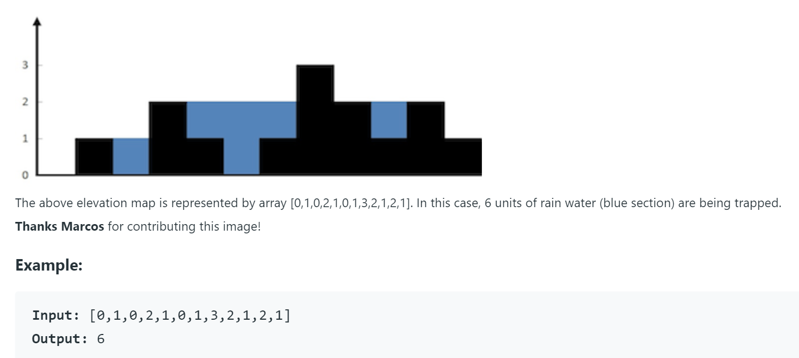

<center></center>
<br>
<h1><p style="text-align: center; color:darkblue">Python Basic</p><h1>
<center><h1>Workshop - 2</h1></center>
<p></p>
<br>


# Subject: Collections - Control Flow Statements

## Coding Challenge-1 : Find the Largest Number

Purpose of the this coding challenge is to solve a simple sorting problem in Python.

### Learning Outcomes

At the end of the this coding challenge, students will be able to;

- get a basic understanding of sorting algorithms.
- demonstrate their knowledge of lists in python
- implement loops to solve the problems in python
- get a better understanding of computational thinking concepts

### Problem Statement
  
- Write a python code that finds the largest number among the ``n`` numbers given by the user as input.

- First, take `n` from the user, then take `n` numbers one by one and select-print the largest one.

- It is forbidden to use ``max()`` function.  

- Indicate which computational thinking concepts have you used.

- Example for user inputs and respective outputs

```text
Input                Output
---------------:     -------------------------:
n = 5, 1 2 3 4 5     The largest number is:  5
n = 3, 67 85 19      The largest number is:  85
```

### Solution :


```python

```

    How many numbers will you enter?7
    Please enter the number: 6
    Please enter the number: 6
    Please enter the number: 6
    Please enter the number: 6
    Please enter the number: 6
    Please enter the number: 6
    Please enter the number: 65
    The largest number is :  65
    

## Coding Challenge-2 : Group Anagrams

Purpose of the this coding challenge is to solve a grouping algorithm in Python.

### Learning Outcomes

At the end of the this coding challenge, students will be able to;

- get a basic understanding of grouping algorithms.
- demonstrate their knowledge of lists, dicts in python
- implement loops to solve the problems in python
- get a better understanding of computational thinking concepts

### Problem Statement
  
- Given a list of strings, group anagrams together.

- Example:

**Input:**
```
["eat", "tea", "tan", "ate", "nat", "bat"],
Output:
[
  ["ate","eat","tea"],
  ["nat","tan"],
  ["bat"]
]
```
Note:
All inputs will be in lowercase.
The order of your output does not matter.

### Solution :


```python
strs = ["eat", "tea", "tan", "ate", "nat", "bat", "cat", "tac"]
```

    [['eat', 'tea', 'ate'], ['tan', 'nat'], ['bat'], ['cat', 'tac']]
    

## Coding Challenge - 3: Calculating the Amount of Water to be Trapped on Terrain

The purpose of this coding challenge is to write a program that calculates the amount of water that can be contained within the generated holes.

### Learning Outcomes

At the end of this coding challenge, students will be able to;

- analyze a problem, identify, and apply programming knowledge for appropriate solution.

- design, implement `while` loops effectively in Python to solve the given problem.

- control loops effectively by using `if` and `control` statements.

- demonstrate their knowledge of algorithmic design principles by using solving the problem effectively.

### Problem Statement

- Given an array of non-negative integers representing an elevation map as shown below where the width of each bar is 1, compute how much water will be trapped on terrain after raining. To clarify further, the black boxes represents terrain and its height, and the blue boxes represents the water that could be trapped on the terrain.



- User can enter as many numbers as they want to represent elevation of the terrain.

- You can assume all the inputs are valid, thus you don't have to do an input check.

- At the end of the program write a comment that indicates which computational thinking heuristics you have used and how you used them.

- Example of user inputs and respective outputs.

```text
Inputs
------------------------------
Type 'ok' when you are done: 5
Type 'ok' when you are done: 4
Type 'ok' when you are done: 5
Type 'ok' when you are done: ok

Output
------
1

Inputs
------------------------------
Type 'ok' when you are done: 2
Type 'ok' when you are done: 1
Type 'ok' when you are done: 2
Type 'ok' when you are done: 3
Type 'ok' when you are done: 2
Type 'ok' when you are done: 3
Type 'ok' when you are done: ok

Output
------
2

Inputs
------------------------------
Type 'ok' when you are done: 6
Type 'ok' when you are done: 5
Type 'ok' when you are done: 8
Type 'ok' when you are done: 9
Type 'ok' when you are done: 2
Type 'ok' when you are done: 4
Type 'ok' when you are done: 3
Type 'ok' when you are done: 6
Type 'ok' when you are done: ok

Output
------
10
```

### Solution :


```python

```

    Type 'ok' when you are done: 4
    Type 'ok' when you are done: 3
    Type 'ok' when you are done: 6
    Type 'ok' when you are done: 0
    Type 'ok' when you are done: 1
    Type 'ok' when you are done: 0
    Type 'ok' when you are done: 2
    Type 'ok' when you are done: ok
    
    Rain-trapped area :  6
    


```python

```
